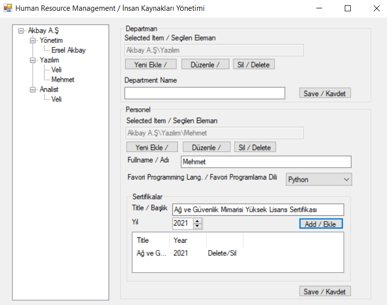

# Human Resource Management

-ENG- 

Human Resources Management is an application prepared with .Net framework. Thanks to this application, which keeps employees, their skills and interests in "instant" memory, it is possible to record certain features.

-TR-
 
İnsan Kaynakları Yönetimi .Net framework ile hazırlanmış bir uygulamadır. Çalışanları, çalışanların sertifikalarını ve ilgi alanlarını "anlık" hafızada tutan bu uygulama sayesinde bazı özellikleri kayıt altına almak mümkün.

